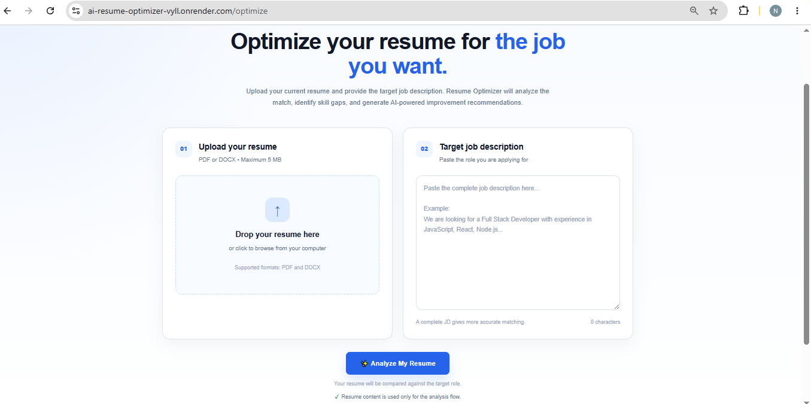

# AI Resume Optimizer

> An AI-powered resume optimization platform that analyzes resumes against job descriptions, evaluates job compatibility, identifies skill and keyword gaps, and generates ATS-focused improvement recommendations.

**Live Demo:** https://ai-resume-optimizer-vyll.onrender.com

**GitHub Repository:** https://github.com/maryam734/ai-resume-optimizerer

---
## Screenshots

### Resume Optimization


### Optimized Resume


### AI-Based Insights


## Overview

AI Resume Optimizer is a full-stack web application designed to help candidates understand how well their resume aligns with a specific job description.

Instead of manually comparing a resume with a job posting, the application automatically extracts resume content, analyzes job requirements, identifies relevant skills and keywords, calculates a compatibility score, detects skill gaps, and provides actionable recommendations.

The project combines a **rule-based resume matching system** with **Google Gemini AI** to provide both measurable compatibility analysis and intelligent resume feedback.

---

## Features

### Resume Upload and Parsing

Users can upload their resumes in supported document formats and automatically extract their resume content for analysis.

The application processes the uploaded document and converts its contents into structured text that can be analyzed by the resume and job-matching systems.

Supported formats include:

- PDF
- DOCX

---

### Job Description Analysis

Users can paste a target job description into the application.

The system analyzes the job description and identifies important information such as:

- Required skills
- Preferred skills
- Technical keywords
- Relevant technologies
- Experience requirements
- Important job-related terms

The extracted requirements are then used by the matching engine to compare the job description with the uploaded resume.

---

### Resume-Job Compatibility Score

The application calculates a compatibility score that represents how closely the resume aligns with the selected job description.

The current rule-based scoring model uses the following weighted components:

| Component | Weight |
|---|---:|
| Required Skills | 60% |
| Preferred Skills | 20% |
| Keywords | 10% |
| Experience | 10% |
| **Total** | **100%** |

Required skills receive the highest weight because they generally represent the most important requirements for a target role.

The final score provides candidates with a quick overview of how closely their resume aligns with the selected job.

---

### Skill Gap Detection

The application identifies differences between the requirements of the job description and the candidate's resume.

It can highlight:

- Skills already present in the resume
- Missing required skills
- Missing preferred skills
- Important missing keywords
- Areas where the resume could be better aligned with the target position

This helps candidates understand exactly what they may need to improve before applying.

---

### AI Resume Analysis

Google Gemini AI is integrated into the application to provide an additional layer of intelligent resume feedback.

The AI analysis can provide:

- Resume strengths
- Resume weaknesses
- Improvement suggestions
- ATS-focused recommendations
- Missing skills and keywords
- Suggestions for better resume positioning
- Recommendations for improving relevance to the target role

The AI layer complements the deterministic rule-based analysis rather than replacing it.

---

### ATS-Focused Recommendations

The application provides recommendations intended to improve resume relevance and readability for Applicant Tracking Systems (ATS).

Examples include:

- Adding relevant technical keywords
- Improving skill alignment
- Strengthening project descriptions
- Improving resume wording
- Removing unnecessary information
- Making experience more relevant to the target role
- Using terminology that more closely matches the target job description

---

### Detailed Analysis Dashboard

After submitting a resume and job description, users receive a structured analysis page containing information such as:

- Overall compatibility score
- Matched skills
- Missing skills
- Keyword gaps
- Resume analysis
- AI-generated feedback
- Improvement recommendations

This allows candidates to understand their results without manually comparing their resume with the job description.

---

## How It Works

The application follows the workflow below:

```text
User Uploads Resume
        ↓
Resume Text Extraction
        ↓
Job Description Analysis
        ↓
Skill & Keyword Extraction
        ↓
Rule-Based Matching Engine
        ↓
Compatibility Score Calculation
        ↓
Skill Gap Detection
        ↓
Gemini AI Analysis
        ↓
Final Resume Recommendations
```

The rule-based engine first performs deterministic analysis such as skill matching, keyword matching, experience evaluation, and compatibility scoring.

Gemini AI then provides additional qualitative feedback based on the resume content and target job description.

---

## System Architecture

```text
                         ┌─────────────────────────┐
                         │        Frontend         │
                         │      EJS + CSS + JS     │
                         └────────────┬────────────┘
                                      │
                                      ▼
                         ┌─────────────────────────┐
                         │      Express Server     │
                         │        Node.js          │
                         └────────────┬────────────┘
                                      │
                ┌─────────────────────┼─────────────────────┐
                │                     │                     │
                ▼                     ▼                     ▼
      ┌──────────────────┐  ┌──────────────────┐  ┌──────────────────┐
      │  Resume Parser   │  │  Matching Engine │  │   Gemini AI      │
      │   PDF / DOCX     │  │ Skills & Keywords│  │ Resume Analyzer  │
      └────────┬─────────┘  └────────┬─────────┘  └────────┬─────────┘
               │                     │                     │
               └─────────────────────┼─────────────────────┘
                                     │
                                     ▼
                           ┌──────────────────────┐
                           │       MongoDB        │
                           │       Database       │
                           └──────────────────────┘
```

---

## Technology Stack

### Frontend

| Technology | Purpose |
|---|---|
| HTML5 | Application structure |
| CSS3 | Styling and responsive design |
| JavaScript | Client-side functionality |
| EJS | Server-side templating |
| EJS Mate | EJS layout management |

### Backend

| Technology | Purpose |
|---|---|
| Node.js | JavaScript runtime |
| Express.js | Backend web framework |

### Database

| Technology | Purpose |
|---|---|
| MongoDB | Data storage |
| Mongoose | MongoDB object modeling |

### AI

| Technology | Purpose |
|---|---|
| Google Gemini | AI-powered resume analysis |
| `@google/genai` | Gemini API integration |

### Resume Processing

| Technology | Purpose |
|---|---|
| Multer | File upload handling |
| PDF Parser | PDF text extraction |
| Mammoth | DOCX text extraction |

### Supporting Tools

| Technology | Purpose |
|---|---|
| dotenv | Environment variable management |
| express-session | Session management |
| connect-mongo | MongoDB-backed session storage |
| Nodemon | Development server auto-restart |
| Git | Version control |
| GitHub | Source code hosting |
| Render | Application deployment |

---

## Project Structure

```text
ai-resume-optimizer/
│
├── models/
│   └── ...
│
├── routes/
│   └── ...
│
├── utils/
│   ├── resumeParser.js
│   ├── resumeanalyser.js
│   ├── jdanalyser.js
│   ├── matchEngine.js
│   └── aiResumeAnalyzer.js
│
├── views/
│   ├── pages/
│   │   ├── home.ejs
│   │   ├── optimize.ejs
│   │   └── results.ejs
│   │
│   └── layouts/
│       └── boilerplate.ejs
│
├── public/
│   ├── css/
│   └── js/
│
├── uploads/
│
├── app.js
├── package.json
├── package-lock.json
├── .gitignore
├── .env.example
└── README.md
```

> The actual project structure may contain additional files and folders depending on the current implementation.

---

## Installation and Setup

### 1. Clone the Repository

```bash
git clone YOUR_GITHUB_REPOSITORY_URL
```

Navigate to the project directory:

```bash
cd ai-resume-optimizer
```

---

### 2. Install Dependencies

```bash
npm install
```

---

### 3. Configure Environment Variables

Create a `.env` file in the project root:

```env
MONGO_URI=your_mongodb_connection_string
GEMINI_API_KEY=your_gemini_api_key
SESSION_SECRET=your_session_secret
```

Replace the placeholder values with your actual configuration.

> **Important:** Never commit the `.env` file to GitHub. Add it to `.gitignore` and use `.env.example` to document the required environment variables.

---

### 4. Start the Application

For development:

```bash
npm run dev
```

Or, if Nodemon is installed globally:

```bash
nodemon app.js
```

For normal execution:

```bash
node app.js
```

The application will run locally at:

```text
http://localhost:8080
```

---

## Environment Variables

The application uses environment variables to securely manage sensitive configuration.

| Variable | Description |
|---|---|
| `MONGO_URI` | MongoDB connection string |
| `GEMINI_API_KEY` | Google Gemini API key |
| `SESSION_SECRET` | Secret used for session management |

Never expose API credentials publicly or commit them to the repository.

---

## Scoring System

The compatibility score is calculated using a weighted rule-based model.

| Component | Weight |
|---|---:|
| Required Skills | 60% |
| Preferred Skills | 20% |
| Keywords | 10% |
| Experience | 10% |
| **Total** | **100%** |

### Required Skills

Required skills are the skills explicitly identified as important for the target role.

They receive the highest weight because required technical or role-specific skills generally have the greatest impact on job compatibility.

### Preferred Skills

Preferred skills are additional capabilities that strengthen a candidate's profile but may not be mandatory.

### Keywords

The system compares important job-description keywords against the extracted resume content.

This helps identify relevant terminology, tools, technologies, and concepts that may be missing from the resume.

### Experience

Relevant experience and background contribute to the overall compatibility evaluation.

---

## AI Analysis

The application uses Google's Gemini API to provide an additional layer of intelligent resume analysis.

The complete analysis pipeline combines two approaches:

```text
Rule-Based Analysis
        +
Gemini AI Analysis
        ↓
Comprehensive Resume Feedback
```

### Rule-Based Analysis

The rule-based engine performs deterministic analysis such as:

- Required skill matching
- Preferred skill matching
- Keyword matching
- Experience-related matching
- Compatibility score calculation
- Skill gap detection

### Gemini AI Analysis

Gemini provides qualitative feedback such as:

- Resume strengths
- Resume weaknesses
- Improvement suggestions
- ATS-focused recommendations
- Missing skills and keywords
- Better resume positioning
- Suggestions for improving alignment with the target role

The combination of these two approaches provides both measurable compatibility results and AI-assisted recommendations.

---

## Why This Project?

Many candidates use the same resume for multiple job applications without checking how closely it matches the requirements of each role.

AI Resume Optimizer addresses this problem by helping candidates:

- Understand resume-job compatibility
- Identify missing skills
- Discover important missing keywords
- Improve resume alignment
- Improve ATS-focused content
- Understand resume strengths and weaknesses
- Receive personalized AI-powered recommendations

Instead of providing only a general resume score, the application performs **job-specific resume analysis**.

---

## Project Highlights

This project demonstrates practical implementation of several real-world software engineering concepts:

- Full-stack web application development
- Resume document processing
- PDF and DOCX text extraction
- Rule-based natural language matching
- Weighted scoring algorithms
- Skill-gap analysis
- AI API integration
- Server-side rendering using EJS
- MongoDB data persistence
- File upload handling
- Session management
- Environment-based configuration
- Cloud deployment
- Git and GitHub workflow

---

## Testing

The application was tested using sample resumes and job descriptions to verify the major workflow:

```text
Resume Upload
      ↓
Resume Parsing
      ↓
Job Description Processing
      ↓
Skill & Keyword Matching
      ↓
Compatibility Score
      ↓
Skill Gap Detection
      ↓
AI Analysis
      ↓
Results Dashboard
```

Testing focused on verifying that the application can successfully:

- Accept supported resume files
- Extract resume text
- Process job descriptions
- Identify relevant skills and keywords
- Calculate a compatibility score
- Detect skill gaps
- Generate AI-based feedback
- Display results on the analysis dashboard

---

## Deployment

The application is deployed using **Render**.

### Live Application

https://ai-resume-optimizer-vyll.onrender.com

The production deployment uses environment variables for configuration, including:

```text
MONGO_URI
GEMINI_API_KEY
SESSION_SECRET
```

---

## Security Considerations

The application follows basic security practices, including:

- Keeping API credentials in environment variables
- Using `.gitignore` to protect sensitive files
- Avoiding hard-coded API keys
- Processing sensitive API credentials on the server side
- Using session secrets through environment variables

Sensitive credentials should never be committed to a public repository.

---

## Limitations

The current system has some practical limitations:

- Resume analysis depends on the quality of extracted document text.
- Job-description parsing depends on the implemented rule-based extraction logic.
- Compatibility scores are an approximation and should not be treated as hiring decisions.
- AI-generated feedback depends on Gemini API availability and quota limits.
- Different companies may use different ATS implementations and scoring criteria.

Therefore, the compatibility score should be treated as a **guidance and optimization tool**, not as an absolute measure of job suitability.

---

## Future Improvements

Potential future enhancements include:

- AI-based resume rewriting
- AI-generated resume bullet points
- Multiple resume comparison
- Resume version management
- Job recommendations based on resume
- Advanced keyword optimization
- Cover letter generation
- Resume section scoring
- Authentication and user profiles
- Resume history and analytics
- Advanced ATS simulation
- Job-description similarity analysis
- Exportable resume analysis reports
- Personalized job application recommendations

---

## Future Scope

The project can be extended into a broader AI-powered career assistance platform:

```text
Resume Analysis
        +
Job Matching
        +
AI Resume Rewriting
        +
Cover Letter Generation
        +
Job Recommendations
        +
Application Tracking
        ↓
Complete AI Career Assistant
```

---

## Learning Outcomes

This project strengthened practical knowledge of:

- Full-stack web development
- Node.js and Express.js
- MongoDB and Mongoose
- Server-side rendering with EJS
- RESTful backend architecture
- File uploading and document processing
- PDF and DOCX text extraction
- Natural language processing concepts
- Rule-based matching systems
- Weighted scoring algorithms
- Skill-gap analysis
- AI API integration
- Google Gemini API
- Environment variable management
- Session management
- Cloud deployment using Render
- Git and GitHub
- Building production-oriented web applications

---

## Author

### Maryam Naim

**B.Tech Computer Science and Engineering**

---

